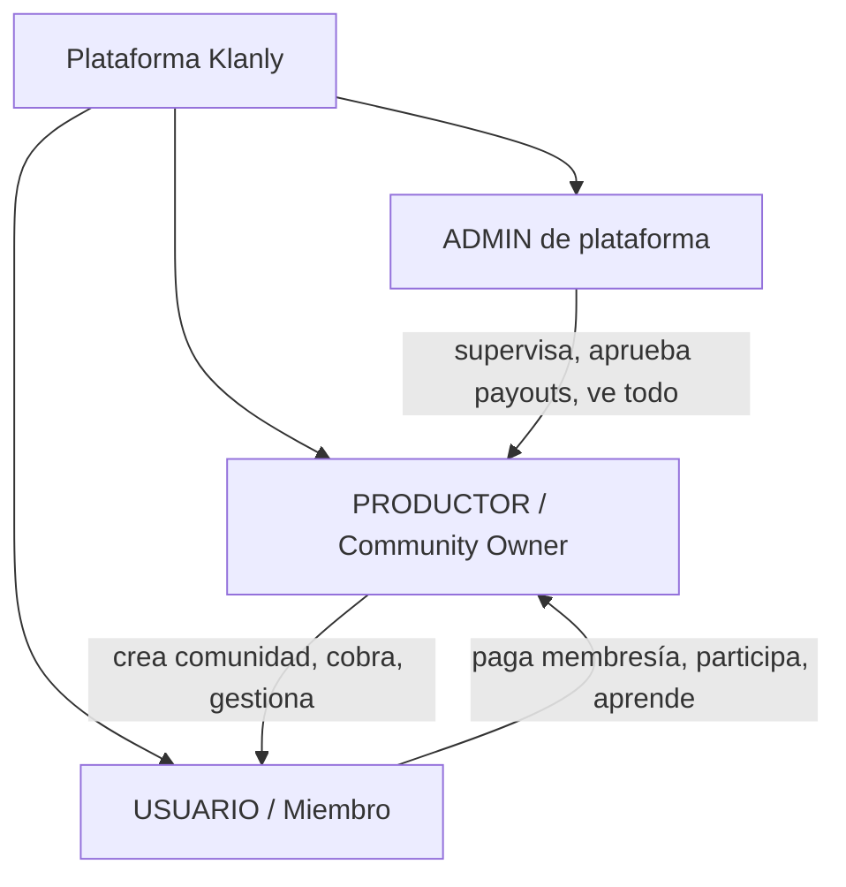
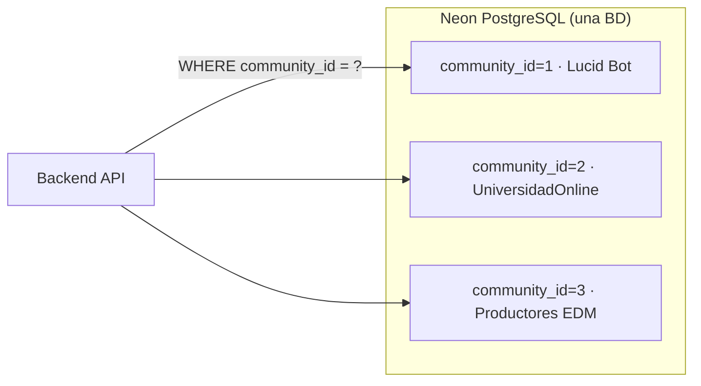
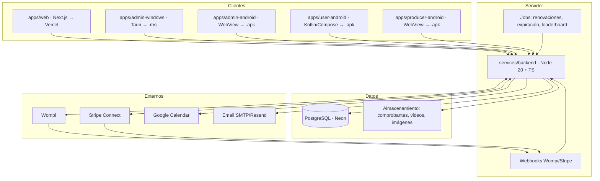
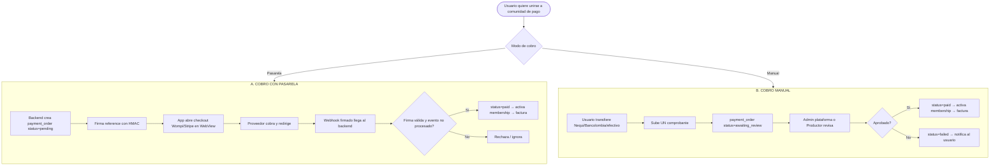
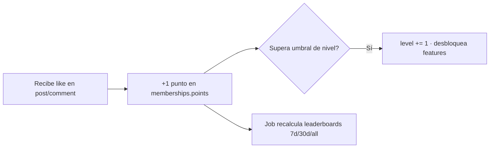
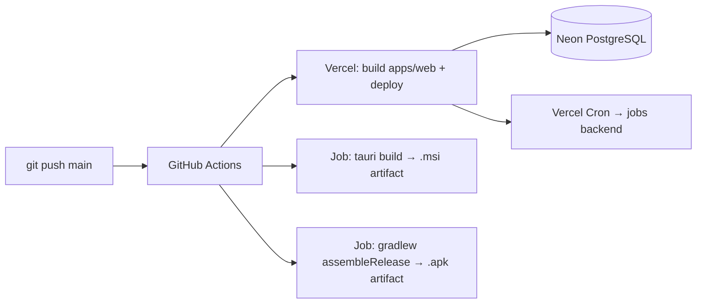

# Guía Técnica — Plataforma de comunidades de pago ("Klanly")

> **Plan de infraestructura y arquitectura técnica** para construir una plataforma de comunidades de pago estilo las plataformas de comunidades de pago, con apps instalables (`.msi` Windows, `.apk` Android), app web en Vercel, y sistema de cobros dual (manual + pasarela) reciclando la lógica probada del proyecto [PlataformasSorteosYRifas](https://github.com/jhonsu01/PlataformasSorteosYRifas).
>
> - **Autor:** Jhon Supelano
> - **Fecha:** 2026-07-23
> - **Versión del plan:** 1.0
> - **Arquitectura evaluada:** HÍBRIDA (backend determinístico de pagos + generación de contenido de comunidad)

---

## Tabla de Contenido

1. [Resumen ejecutivo](#1-resumen-ejecutivo)
2. [Análisis funcional (qué construimos)](#2-análisis-funcional-qué-construimos)
3. [Roles y modelo multi-tenant](#3-roles-y-modelo-multi-tenant)
4. [Arquitectura general (monorepo)](#4-arquitectura-general-monorepo)
5. [Stack tecnológico](#5-stack-tecnológico)
6. [Modelo de datos (PostgreSQL)](#6-modelo-de-datos-postgresql)
7. [Módulo de pagos — el corazón reciclado de rifas](#7-módulo-de-pagos--el-corazón-reciclado-de-rifas)
8. [API del backend](#8-api-del-backend)
9. [App web (Next.js → Vercel)](#9-app-web-nextjs--vercel)
10. [App Admin Windows (Tauri → .msi)](#10-app-admin-windows-tauri--msi)
11. [Apps Android (.apk): usuario, productor, admin](#11-apps-android-apk-usuario-productor-admin)
12. [Gamificación (niveles y leaderboards)](#12-gamificación-niveles-y-leaderboards)
13. [Classroom (cursos y lecciones)](#13-classroom-cursos-y-lecciones)
14. [Comunidad, calendario, chat y notificaciones](#14-comunidad-calendario-chat-y-notificaciones)
15. [Seguridad](#15-seguridad)
16. [Infraestructura, despliegue y CI/CD](#16-infraestructura-despliegue-y-cicd)
17. [Variables de entorno](#17-variables-de-entorno)
18. [Estructura de carpetas del monorepo](#18-estructura-de-carpetas-del-monorepo)
19. [Roadmap por fases](#19-roadmap-por-fases)
20. [Mapa de reciclaje rifas → Klanly](#20-mapa-de-reciclaje-rifas--klanly)

---

## 1. Resumen ejecutivo

**Objetivo:** construir una plataforma SaaS de **comunidades de pago** donde un **productor** (creador) crea su comunidad, publica cursos, organiza eventos, gamifica la participación y **cobra membresías mensuales o pagos únicos** a sus **usuarios (miembros)**, mientras un **admin de plataforma** supervisa todo y administra los pagos, comisiones y liquidaciones.

**Diferenciadores frente a las plataformas cerradas del mercado (que solo usan Stripe):**

| Necesidad | Las plataformas cerradas | Klanly (este plan) |
| --- | --- | --- |
| Cobro con tarjeta internacional | Stripe | **Wompi** (LATAM: tarjeta, PSE, Nequi, Bancolombia) + Stripe opcional |
| Cobro manual (transferencia/Nequi/efectivo) | ❌ No existe | ✅ **Comprobante + verificación** (reciclado de rifas) |
| App instalable Windows | ❌ Solo web | ✅ **`.msi` (Tauri)** para admin/productor |
| App Android | App oficial cerrada | ✅ **`.apk` propias** por rol |
| Liquidación a productores | Stripe Connect | Stripe Connect + **payout manual auditado** |

**Reutilización clave:** El proyecto de rifas ya resolvió los problemas difíciles: monorepo con `.msi`/`.apk`/Vercel, cobros con Wompi + webhooks firmados con HMAC, **cobros manuales con comprobante verificado**, reserva atómica de órdenes, 2FA para admins e idempotencia de webhooks. Aquí **adaptamos** esa maquinaria de "vender números de rifa" a "vender/renovar membresías de comunidad".

---

## 2. Análisis funcional (qué construimos)

Derivado del análisis de las capturas del sitio real. Cada comunidad (ej. *Lucid Bot*, *UniversidadOnline®*) expone estas secciones:

### 2.1 Navegación principal de una comunidad
`Community` · `Classroom` · `Calendar` · `Members` · `Leaderboards` · `About`

| Módulo | Descripción (según capturas) |
| --- | --- |
| **Community** | Feed de posts con comentarios, likes, categorías, fijados. Perfil con *heatmap* de contribuciones estilo GitHub. |
| **Classroom** | Grid de cursos con portada, % de progreso. Dentro: módulos plegables → lecciones con **video**, marcado de "completado", lecciones **bloqueadas por nivel** (🔒 "Unlock at level X"). |
| **Calendar** | Lista/calendario de eventos con fecha/hora, enlace (Meet/Link), recurrentes. Integración con **Google Calendar** ("Add to calendar"). |
| **Members** | Directorio con búsqueda, filtros `Members / Admins / Online`, bio, "Joined", ubicación, botón **CHAT** e **INVITE**. |
| **Leaderboards** | Niveles **1–9** con % de miembros por nivel, "N points to level up", desbloqueo de features (Post to feed, Chat) por nivel. Tres tablas: **7-day / 30-day / all-time**. |
| **About** | Descripción, reglas, contadores (Members / Online / Admins), lista de admins, precio. |

### 2.2 Nivel usuario (settings globales)
Menú lateral observado en `klanly.app/settings`:

`Communities` (reordenar/fijar/ocultar) · `Profile` · `Affiliates` · `Payouts` · `Account` · `Notifications` · `Chat` · `Payment methods` · `Payment history` · `Theme`

| Sección | Detalle observado |
| --- | --- |
| **Affiliates** | Comisión **40%** de por vida por invitar a crear/unirse. Links por comunidad, balance (Last 30 days / Lifetime / Account balance), botón **PAYOUT**, lista de referidos. |
| **Payouts** | "Payouts for community and affiliate earnings" — vía **Stripe Connect** ("la plataforma se asocia a Stripe"). |
| **Payment methods** | Tarjetas guardadas ("ADD PAYMENT METHOD", tokenización). |
| **Payment history** | Historial: *"December 9th 2025 — $12 for Cashflow-5k membership"*. |
| **Invoice** | Factura con nº, fecha, método (VISA-4383), From/To, línea "monthly membership", total USD. |
| **Theme** | Tema claro/oscuro y personalización. |

### 2.3 Membresías
Un usuario pertenece a varias comunidades; cada una es **Free** o de pago (`$17/month`, `$12/month`, etc.). Al unirse a una de pago → checkout → suscripción recurrente → factura → acceso.

---

## 3. Roles y modelo multi-tenant

### 3.1 Los tres roles que pediste



| Rol | Alcance | Capacidades principales | App recomendada |
| --- | --- | --- | --- |
| **ADMIN (plataforma)** | Global | Ver todas las comunidades, aprobar/rechazar comprobantes manuales, ejecutar/aprobar payouts, gestionar comisiones, 2FA obligatorio, auditoría, suspender cuentas. | **`.msi` Windows** + `.apk` admin |
| **PRODUCTOR (owner)** | Su(s) comunidad(es) | Crear comunidad, definir precio/plan, subir cursos, crear eventos, moderar feed, gestionar miembros/roles (Admin/Moderator), ver ingresos, solicitar payout, verificar cobros manuales de su comunidad. | Web + `.apk` productor + `.msi` |
| **USUARIO (miembro)** | Comunidades a las que pertenece | Pagar membresía (pasarela o manual), postear/comentar, tomar cursos, asistir a eventos, chatear, subir de nivel, ser afiliado. | Web + `.apk` usuario |

> **Roles internos de comunidad** (heredados del sector, dentro del alcance del productor): `Owner` → `Admin` → `Moderator` → `Member`. Son distintos del ADMIN de plataforma.

### 3.2 Multi-tenancy
Cada comunidad = un **tenant** identificado por `slug` (ej. `/@lucidbot`). Estrategia recomendada: **base de datos compartida con `community_id` en cada tabla** (row-level scoping) + índices por tenant. Es más simple de operar en Neon/PostgreSQL que schema-per-tenant y suficiente para el volumen esperado.



---

## 4. Arquitectura general (monorepo)

Reutilizamos **el mismo layout de monorepo** que rifas (probado en producción):



**Principio:** todos los clientes son "tontos" (UI); **toda la lógica de dinero, permisos y estado vive en el backend**. Las apps `.msi`/`.apk` de admin/productor pueden ser **WebView** que apunta a la app web (como hace rifas con `admin-android`/`seller-android`), salvo la app de usuario que puede ser nativa para mejor experiencia.

---

## 5. Stack tecnológico

| Capa | Tecnología | Justificación |
| --- | --- | --- |
| **Web** | Next.js 14 (App Router) + React + TypeScript + Tailwind | SSR/SEO para páginas públicas de comunidad, despliegue directo en Vercel. |
| **Backend** | Node.js 20 + TypeScript + Fastify/Express | Mismo runtime que rifas; reciclamos rutas de pagos. |
| **Base de datos** | PostgreSQL 16 (Neon, con `-pooler`) | Serverless, escalable, ya usado en rifas. |
| **ORM/migraciones** | Prisma o Drizzle + SQL migrations | Tipado end-to-end. |
| **Admin Windows** | Tauri v2 (Rust shell + web UI) → `.msi` | Ligero (~5MB), firma de código, auto-update. |
| **Android** | Kotlin + Jetpack Compose (usuario) / WebView (admin, productor) | Nativo donde importa; WebView donde se reutiliza la web. |
| **Auth** | JWT + refresh tokens + 2FA (TOTP) para admin/productor | Reciclado de rifas. |
| **Pagos** | Wompi (LATAM) + Stripe Connect (internacional/payouts) | Dual. |
| **Almacenamiento** | Vercel Blob / Cloudflare R2 / S3 | Comprobantes, videos de cursos, avatares. |
| **Email** | Resend o SMTP (Gmail app password como en rifas) | Facturas, credenciales, notificaciones. |
| **Realtime** | WebSocket (Socket.io) o Pusher | Chat y notificaciones en vivo. |
| **Jobs/CRON** | Vercel Cron / node-cron protegido con `CRON_SECRET` | Renovaciones, expiración, recálculo de leaderboard. |

---

## 6. Modelo de datos (PostgreSQL)

Esquema central. Se mantiene la filosofía de rifas: **hechos inmutables + `audit_log` + `processed_events`** para idempotencia.

```sql
-- ========== IDENTIDAD Y TENANTS ==========
CREATE TABLE users (
    id              UUID PRIMARY KEY DEFAULT gen_random_uuid(),
    email           TEXT UNIQUE NOT NULL,
    password_hash   TEXT NOT NULL,
    display_name    TEXT NOT NULL,
    handle          TEXT UNIQUE NOT NULL,        -- @jhon-supelano-8337
    avatar_url      TEXT,
    bio             TEXT,
    country         TEXT,
    platform_role   TEXT NOT NULL DEFAULT 'user' -- user | producer | admin
                    CHECK (platform_role IN ('user','producer','admin')),
    totp_secret     TEXT,                        -- 2FA (admin/producer)
    created_at      TIMESTAMPTZ NOT NULL DEFAULT now()
);

CREATE TABLE communities (
    id              UUID PRIMARY KEY DEFAULT gen_random_uuid(),
    slug            TEXT UNIQUE NOT NULL,        -- lucidbot
    name            TEXT NOT NULL,
    description     TEXT,
    icon_url        TEXT,
    owner_id        UUID NOT NULL REFERENCES users(id),
    is_public       BOOLEAN NOT NULL DEFAULT true,
    price_cents     INTEGER NOT NULL DEFAULT 0,  -- 0 = Free
    currency        TEXT NOT NULL DEFAULT 'USD',
    billing_period  TEXT NOT NULL DEFAULT 'month'-- month | year | one_time
                    CHECK (billing_period IN ('month','year','one_time','free')),
    theme           JSONB DEFAULT '{}',
    created_at      TIMESTAMPTZ NOT NULL DEFAULT now()
);

-- Roles DENTRO de una comunidad
CREATE TABLE memberships (
    id              UUID PRIMARY KEY DEFAULT gen_random_uuid(),
    community_id    UUID NOT NULL REFERENCES communities(id),
    user_id         UUID NOT NULL REFERENCES users(id),
    role            TEXT NOT NULL DEFAULT 'member'  -- owner|admin|moderator|member
                    CHECK (role IN ('owner','admin','moderator','member')),
    status          TEXT NOT NULL DEFAULT 'active'  -- active|past_due|canceled|pending
                    CHECK (status IN ('active','past_due','canceled','pending')),
    level           INTEGER NOT NULL DEFAULT 1,     -- gamificación 1..9
    points          INTEGER NOT NULL DEFAULT 0,
    joined_at       TIMESTAMPTZ NOT NULL DEFAULT now(),
    UNIQUE (community_id, user_id)
);

-- ========== PAGOS (reciclado de rifas) ==========
-- "orden" equivale a la ORDEN de compra de números; aquí es un cobro de membresía
CREATE TABLE payment_orders (
    id                UUID PRIMARY KEY DEFAULT gen_random_uuid(),
    community_id      UUID NOT NULL REFERENCES communities(id),
    user_id           UUID NOT NULL REFERENCES users(id),
    membership_id     UUID REFERENCES memberships(id),
    amount_cents      INTEGER NOT NULL,
    currency          TEXT NOT NULL DEFAULT 'USD',
    method            TEXT NOT NULL,     -- wompi | stripe | manual
    kind              TEXT NOT NULL,     -- subscription_initial | renewal | one_time
    status            TEXT NOT NULL DEFAULT 'pending'
                      CHECK (status IN ('pending','awaiting_review','paid','failed','expired','refunded')),
    reference         TEXT UNIQUE NOT NULL,       -- referencia firmada HMAC
    integrity_hash    TEXT NOT NULL,              -- HMAC(reference|amount|currency|secret)
    manual_proof_url  TEXT,                       -- comprobante (cobro manual)
    reviewed_by       UUID REFERENCES users(id),  -- admin/productor que aprobó
    expires_at        TIMESTAMPTZ,                -- reserva/expiración
    created_at        TIMESTAMPTZ NOT NULL DEFAULT now(),
    paid_at           TIMESTAMPTZ
);

-- Suscripciones recurrentes (tokenización de tarjeta)
CREATE TABLE subscriptions (
    id                 UUID PRIMARY KEY DEFAULT gen_random_uuid(),
    community_id       UUID NOT NULL REFERENCES communities(id),
    user_id            UUID NOT NULL REFERENCES users(id),
    status             TEXT NOT NULL DEFAULT 'active'  -- active|past_due|canceled
                       CHECK (status IN ('active','past_due','canceled')),
    provider           TEXT NOT NULL,          -- wompi | stripe | manual
    payment_source_id  TEXT,                   -- token de fuente de pago (Wompi) / customer (Stripe)
    current_period_end TIMESTAMPTZ NOT NULL,   -- próxima renovación
    cancel_at_end      BOOLEAN NOT NULL DEFAULT false,
    created_at         TIMESTAMPTZ NOT NULL DEFAULT now()
);

-- Idempotencia de webhooks (idéntico a processed_events de rifas)
CREATE TABLE processed_events (
    event_id     TEXT PRIMARY KEY,   -- id del evento del proveedor
    provider     TEXT NOT NULL,
    processed_at TIMESTAMPTZ NOT NULL DEFAULT now()
);

-- ========== AFILIADOS Y PAYOUTS ==========
CREATE TABLE affiliate_referrals (
    id             UUID PRIMARY KEY DEFAULT gen_random_uuid(),
    referrer_id    UUID NOT NULL REFERENCES users(id),
    referred_id    UUID NOT NULL REFERENCES users(id),
    community_id   UUID REFERENCES communities(id),
    commission_pct NUMERIC(5,2) NOT NULL DEFAULT 40.00,
    created_at     TIMESTAMPTZ NOT NULL DEFAULT now()
);

CREATE TABLE payouts (
    id            UUID PRIMARY KEY DEFAULT gen_random_uuid(),
    payee_id      UUID NOT NULL REFERENCES users(id),  -- productor o afiliado
    amount_cents  INTEGER NOT NULL,
    currency      TEXT NOT NULL DEFAULT 'USD',
    kind          TEXT NOT NULL,     -- community_earnings | affiliate
    method        TEXT NOT NULL,     -- stripe_connect | manual_transfer
    status        TEXT NOT NULL DEFAULT 'requested'
                  CHECK (status IN ('requested','approved','paid','rejected')),
    approved_by   UUID REFERENCES users(id),
    created_at    TIMESTAMPTZ NOT NULL DEFAULT now()
);

-- ========== CONTENIDO ==========
CREATE TABLE posts (            -- feed de comunidad
    id UUID PRIMARY KEY DEFAULT gen_random_uuid(),
    community_id UUID NOT NULL REFERENCES communities(id),
    author_id UUID NOT NULL REFERENCES users(id),
    title TEXT, body TEXT, category TEXT,
    pinned BOOLEAN DEFAULT false,
    like_count INTEGER DEFAULT 0,
    created_at TIMESTAMPTZ NOT NULL DEFAULT now()
);
CREATE TABLE comments (
    id UUID PRIMARY KEY DEFAULT gen_random_uuid(),
    post_id UUID NOT NULL REFERENCES posts(id),
    author_id UUID NOT NULL REFERENCES users(id),
    body TEXT NOT NULL, parent_id UUID REFERENCES comments(id),
    created_at TIMESTAMPTZ NOT NULL DEFAULT now()
);
CREATE TABLE courses (
    id UUID PRIMARY KEY DEFAULT gen_random_uuid(),
    community_id UUID NOT NULL REFERENCES communities(id),
    title TEXT NOT NULL, cover_url TEXT, description TEXT,
    min_level INTEGER DEFAULT 1,        -- bloqueo por nivel
    position INTEGER DEFAULT 0
);
CREATE TABLE lessons (
    id UUID PRIMARY KEY DEFAULT gen_random_uuid(),
    course_id UUID NOT NULL REFERENCES courses(id),
    module_name TEXT, title TEXT NOT NULL,
    video_url TEXT, content TEXT, position INTEGER DEFAULT 0,
    min_level INTEGER DEFAULT 1
);
CREATE TABLE lesson_progress (
    user_id UUID NOT NULL REFERENCES users(id),
    lesson_id UUID NOT NULL REFERENCES lessons(id),
    completed BOOLEAN DEFAULT false,
    completed_at TIMESTAMPTZ,
    PRIMARY KEY (user_id, lesson_id)
);
CREATE TABLE events (           -- calendario
    id UUID PRIMARY KEY DEFAULT gen_random_uuid(),
    community_id UUID NOT NULL REFERENCES communities(id),
    title TEXT NOT NULL, starts_at TIMESTAMPTZ NOT NULL,
    ends_at TIMESTAMPTZ, link_url TEXT, kind TEXT,  -- meet | link
    gcal_event_id TEXT
);

-- ========== AUDITORÍA (idéntico a rifas) ==========
CREATE TABLE audit_log (
    id BIGSERIAL PRIMARY KEY,
    actor_id UUID REFERENCES users(id),
    action TEXT NOT NULL,
    entity TEXT, entity_id TEXT,
    metadata JSONB,
    created_at TIMESTAMPTZ NOT NULL DEFAULT now()
);
```

> **Índices recomendados:** `memberships(community_id, user_id)`, `payment_orders(status, expires_at)`, `payment_orders(reference)`, `subscriptions(current_period_end)`, `posts(community_id, created_at DESC)`.

---

## 7. Módulo de pagos — el corazón reciclado de rifas

Este es el módulo donde **más código se recicla**. En rifas el flujo era: *reservar números → firmar referencia HMAC → checkout Wompi → webhook firmado → vender números*. Aquí se transforma en: *crear orden de membresía → firmar referencia → checkout → webhook → activar/renovar membresía*.

### 7.1 Los dos modos de cobro



### 7.2 Cobro con pasarela (Wompi) — reciclado directo

**Del repo de rifas se reutiliza casi 1:1:**
- `services/backend/src/routes/webhooks.js` → `webhooks/wompi` (validación de firma de eventos con `WOMPI_EVENTS_KEY`).
- `services/backend/src/routes/purchases.js` → lógica de creación de orden + firma HMAC de integridad.
- La **reserva atómica** de números pasa a ser **reserva de la orden de membresía** (evita doble cobro por doble clic).

**Firma de integridad (HMAC), idéntica a rifas:**
```
integrity = SHA256( reference + amount_in_cents + currency + WOMPI_INTEGRITY_SECRET )
```
Wompi valida esa firma en el checkout; el backend valida la firma del **webhook** antes de dar por pagada la orden. Esto ya está resuelto en rifas.

**Suscripciones recurrentes con Wompi:** en la primera compra se **tokeniza la tarjeta** (se crea una *fuente de pago* → `payment_source_id`). Las renovaciones mensuales las dispara un **CRON** (`current_period_end <= now()`) que cobra contra esa fuente de pago sin intervención del usuario. Los métodos no-tokenizables (PSE) se renuevan pidiendo nuevo pago (email de recordatorio).

### 7.3 Cobro manual — reciclado directo

Es **la misma mecánica de "pagos manuales" de rifas**, donde el comprador subía un comprobante para toda la orden y un admin/vendedor lo verificaba:

| Rifas | Klanly |
| --- | --- |
| Comprador sube 1 comprobante por orden de números | Usuario sube 1 comprobante por orden de membresía |
| Admin **o vendedor asignado** verifica | Admin de plataforma **o productor** verifica |
| Aprobación vende todos los números | Aprobación activa la membresía (y fija `current_period_end`) |
| Filtro por vendedor y fechas, export JSON | Filtro por comunidad/productor y fechas, export |

**Estados:** `pending → awaiting_review → paid | failed`. Todo cambio queda en `audit_log` con `reviewed_by`.

### 7.4 Payouts a productores y afiliados

- **Afiliados:** comisión **40%** (configurable en `affiliate_referrals.commission_pct`) como es estándar en el sector. El link de referido lleva `?ref=<hash>`; al convertir, se crea el registro y se acumula al balance.
- **Payout automático:** vía **Stripe Connect** (onboarding "la plataforma se asocia a Stripe" → cuenta conectada del productor).
- **Payout manual auditado:** el productor solicita, el **ADMIN aprueba** (`payouts.status: requested → approved → paid`), transferencia por fuera + registro. Útil en LATAM donde Stripe Connect no siempre aplica.

### 7.5 Facturación
Al pasar a `paid` se genera **factura** (nº correlativo, From/To, línea de membresía, método, total) — replicando el invoice observado en el mercado. Se envía por email y queda en `Payment history`.

---

## 8. API del backend

Endpoints REST principales (todos con scoping por `community_id` y validación de rol):

```
# Auth
POST   /auth/register
POST   /auth/login                 -> JWT + refresh
POST   /auth/2fa/verify            (admin/producer)
POST   /auth/refresh

# Comunidades
GET    /communities                 (discover/públicas)
POST   /communities                 (productor crea)
GET    /communities/:slug
PATCH  /communities/:id             (owner/admin)
GET    /communities/:id/members
POST   /communities/:id/join        -> inicia flujo de pago si es de pago

# Pagos
POST   /payments/orders             -> crea orden + firma HMAC (pasarela)
POST   /payments/orders/manual      -> crea orden manual + sube comprobante
POST   /payments/orders/:id/review  -> admin/productor aprueba/rechaza manual
GET    /payments/history            -> payment history del usuario
POST   /webhooks/wompi              -> idempotente + firma
POST   /webhooks/stripe             -> idempotente + firma
GET    /subscriptions               -> las mías
POST   /subscriptions/:id/cancel

# Afiliados / Payouts
GET    /affiliates/me               -> balance, links, referidos
POST   /payouts                     -> solicitar (productor/afiliado)
POST   /payouts/:id/approve         -> ADMIN

# Contenido
GET/POST/PATCH/DELETE  /communities/:id/posts
POST   /posts/:id/comments
GET/POST  /communities/:id/courses
POST   /lessons/:id/complete        -> marca progreso + suma puntos
GET/POST  /communities/:id/events
GET    /communities/:id/leaderboard?range=7d|30d|all

# Admin plataforma
GET    /admin/overview              -> métricas globales
GET    /admin/payments/pending      -> comprobantes por revisar
GET    /admin/audit                 -> audit_log
```

**Jobs (CRON protegido con `CRON_SECRET`):**
- `renew-subscriptions` — cobra suscripciones vencidas contra token.
- `expire-orders` — marca `expired` las órdenes `pending` vencidas (igual que rifas).
- `recompute-leaderboard` — recalcula puntos 7d/30d/all-time.
- `dunning` — reintentos + emails a `past_due`.

---

## 9. App web (Next.js → Vercel)

**Rol:** cliente principal para usuarios y productores; también base de las WebView de las apps móviles/desktop de admin/productor.

- **App Router** con rutas:
  - `/(public)` — landing, `/discover`, `/@slug` (página pública de comunidad, SSR para SEO).
  - `/(app)` — feed, classroom, calendar, members, leaderboards (autenticado).
  - `/settings` — profile, affiliates, payouts, payment-methods, payment-history, theme.
  - `/admin` — panel de productor (ingresos, miembros, cursos, eventos).
- **Checkout** embebido (Wompi Widget / Stripe Elements) con retorno a `/payments/return`.
- **Theme** claro/oscuro (observado en el mercado).
- **Deploy:** push a `main` → Vercel build. Variables de entorno en Vercel (Wompi, Stripe, `DATABASE_URL`, `CRON_SECRET`). Vercel Cron para los jobs.

---

## 10. App Admin Windows (Tauri → .msi)

**Rol:** panel de escritorio para **ADMIN de plataforma** (y opcionalmente productor) — el mismo patrón `admin-windows` de rifas.

- **Tauri v2:** shell Rust + UI web (reutiliza componentes de la web). Binario pequeño, arranque instantáneo.
- **Empaquetado:** `tauri build` → instalador **`.msi`** (WiX) firmado.
- **Funciones offline-first mínimas:** cache local del panel; el resto llama a la API.
- **Pantallas clave:** cola de comprobantes por aprobar, aprobación de payouts, auditoría, métricas, gestión de comunidades/usuarios.
- **Seguridad:** login + **2FA obligatorio** (TOTP), igual que rifas.
- **Auto-update:** updater de Tauri apuntando a un endpoint de releases.

```bash
# Build del .msi
cd apps/admin-windows
npm install
npm run tauri build          # genera target/release/bundle/msi/*.msi
```

---

## 11. Apps Android (.apk): usuario, productor, admin

Siguiendo rifas (que tiene `android` nativo Kotlin + `admin-android`/`seller-android` WebView):

| App | Tipo | Público | Contenido |
| --- | --- | --- | --- |
| **user-android** | **Nativa** (Kotlin + Compose) | Usuarios | Feed, classroom (player de video), calendar, chat, notificaciones push, checkout en WebView. |
| **producer-android** | **WebView** | Productores | Envuelve el panel web `/admin`. Rápido de mantener. |
| **admin-android** | **WebView** | Admin plataforma | Envuelve `/admin` de plataforma; aprobar comprobantes/payouts desde el móvil. |

- **Checkout:** el pago con Wompi/Stripe se abre en **WebView** y la app detecta el retorno por URL (patrón exacto de rifas).
- **Build del `.apk`:**
```bash
cd apps/user-android
./gradlew assembleRelease      # genera app-release.apk (firmado con keystore)
```
- **Push notifications:** FCM (Firebase Cloud Messaging) para chat/eventos/nivel.
- **Distribución:** Google Play o `.apk` directo (sideload) para pruebas internas — como ya haces en rifas al enviar la app al vendedor por email.

---

## 12. Gamificación (niveles y leaderboards)

Replicando lo observado en *Leaderboards*:

- **Niveles 1–9.** Cada nivel exige acumular puntos; se muestra `% of members` por nivel y "N points to level up".
- **Puntos:** +1 por like recibido (regla configurable). Se acumulan en `memberships.points`.
- **Desbloqueo de features por nivel:** ej. Nivel 2 → "Post to feed", Nivel 3 → "Chat with members". Se controla comparando `memberships.level` con `min_level` de la acción/curso/lección.
- **Tres tablas:** 7-day, 30-day, all-time. Se calculan con un **job** `recompute-leaderboard` (suma de puntos por ventana temporal) y se cachean.



---

## 13. Classroom (cursos y lecciones)

- **Estructura:** `courses` → módulos (agrupación por `module_name`) → `lessons` (video + contenido).
- **Progreso:** `lesson_progress` por usuario; barra `%` por curso (observado: "0%").
- **Bloqueo:** `courses.min_level` / `lessons.min_level` vs nivel del miembro (🔒 en capturas).
- **Video:** almacenado en Blob/R2 o embebido (YouTube/Vimeo privado). Player en web y app nativa.
- **Marcado "completado":** `POST /lessons/:id/complete` → actualiza progreso y puede otorgar puntos.

---

## 14. Comunidad, calendario, chat y notificaciones

- **Feed (Community):** `posts` + `comments` con categorías, fijados, likes. Heatmap de contribuciones = agregación de actividad por día (estilo GitHub, observado en el perfil).
- **Calendar:** `events` con `starts_at`, enlace Meet/Link, recurrencia; **sync con Google Calendar** (`gcal_event_id`) para "Add to calendar".
- **Members:** directorio con filtros `Members/Admins/Online`, búsqueda, estado online (realtime), botón CHAT e INVITE.
- **Chat:** 1-a-1 y grupal por comunidad vía WebSocket; gate por nivel (Nivel 3 desbloquea chat).
- **Notificaciones:** in-app + email + push (FCM). Preferencias en `settings/notifications`.

---

## 15. Seguridad

Heredada de rifas y reforzada:

- **HMAC** en referencias de pago e integridad de webhooks (Wompi/Stripe). Nunca confiar en el redirect del cliente: la verdad la da el **webhook firmado**.
- **Idempotencia** con `processed_events` (un evento nunca se procesa dos veces).
- **2FA (TOTP) obligatorio** para `admin` y `producer`.
- **JWT + refresh tokens**; scoping por `community_id` en cada consulta (evita fugas cross-tenant).
- **Reserva atómica** de órdenes (transacción) para evitar doble cobro.
- **Privacidad:** los estados públicos nunca exponen email, teléfono, documento ni comprobantes (regla explícita de rifas — se mantiene).
- **`audit_log`** de toda acción sensible (aprobaciones, payouts, cambios de rol).
- **Rate limiting** en auth y endpoints de pago.
- **Secretos solo en `.env`/variables de Vercel**, nunca en el repo.

---

## 16. Infraestructura, despliegue y CI/CD



| Componente | Hosting |
| --- | --- |
| Web + API (Next.js API routes o servicio aparte) | **Vercel** |
| Base de datos | **Neon** (PostgreSQL serverless, connection pooling) |
| Blobs (comprobantes/videos) | Vercel Blob / Cloudflare R2 |
| `.msi` y `.apk` | Artefactos de GitHub Releases (auto-update Tauri / distribución APK) |
| Cron | Vercel Cron (con `CRON_SECRET`) |

**Pipeline CI/CD (GitHub Actions):**
1. Lint + typecheck + tests (rifas tiene 130 tests; replicar cobertura de atomicidad de pagos y privacidad).
2. Deploy web a Vercel.
3. Build condicional de `.msi` (Windows runner) y `.apk` (Ubuntu runner) al taggear release.

---

## 17. Variables de entorno

```bash
# --- Base ---
DATABASE_URL=postgres://...-pooler.neon.tech/db   # con -pooler
JWT_SECRET=...
CRON_SECRET=...                                   # protege jobs

# --- Wompi (pasarela LATAM) ---
WOMPI_ENV=test                                    # test | prod
WOMPI_PUBLIC_KEY=...
WOMPI_INTEGRITY_SECRET=...
WOMPI_EVENTS_KEY=...                              # valida firma de webhooks

# --- Stripe (payouts/internacional, opcional) ---
STRIPE_SECRET_KEY=...
STRIPE_WEBHOOK_SECRET=...
STRIPE_CONNECT_CLIENT_ID=...

# --- Email (facturas/credenciales, como rifas) ---
GMAIL_USER=...
GMAIL_APP_PASSWORD=...                            # 16 caracteres
# o
RESEND_API_KEY=...

# --- Almacenamiento ---
BLOB_READ_WRITE_TOKEN=...                         # Vercel Blob / R2

# --- Google Calendar ---
GOOGLE_CLIENT_ID=...
GOOGLE_CLIENT_SECRET=...

# --- Push ---
FCM_SERVER_KEY=...
```

---

## 18. Estructura de carpetas del monorepo

Calcada de rifas (para máxima reutilización):

```
klanly/
├── apps/
│   ├── web/                 # Next.js → Vercel (usuarios + productores)
│   ├── admin-windows/       # Tauri v2 → .msi (admin plataforma)
│   ├── admin-android/       # WebView → .apk (admin)
│   ├── producer-android/    # WebView → .apk (productor)
│   └── user-android/         # Kotlin + Compose → .apk (usuario)
├── services/
│   └── backend/
│       ├── src/
│       │   ├── routes/
│       │   │   ├── auth.ts
│       │   │   ├── communities.ts
│       │   │   ├── payments.ts      # ← reciclado de purchases.js
│       │   │   ├── webhooks.ts      # ← reciclado de webhooks.js
│       │   │   ├── subscriptions.ts
│       │   │   ├── affiliates.ts
│       │   │   ├── payouts.ts
│       │   │   ├── courses.ts
│       │   │   └── admin.ts
│       │   ├── jobs/                # renew, expire, leaderboard, dunning
│       │   ├── lib/                 # hmac, wompi, stripe, mailer
│       │   └── db/
│       │       └── migrations/
│       └── tests/                   # atomicidad de pagos + privacidad
├── packages/
│   ├── schemas/             # JSON Schemas compartidos
│   └── ui/                  # componentes compartidos web/tauri
├── .github/workflows/       # CI/CD (deploy web, build msi, build apk)
├── .env.example
└── guia.md                  # este documento
```

---

## 19. Roadmap por fases

| Fase | Alcance | Entregable |
| --- | --- | --- |
| **F0 · Base** | Monorepo, auth+2FA, modelo de datos, multi-tenant, comunidad Free. | Web con login y creación de comunidad gratis. |
| **F1 · Pagos (núcleo)** | Reciclar Wompi + webhooks HMAC + **cobro manual con comprobante** + facturas + suscripciones. | Unirse a comunidad de pago (pasarela y manual). |
| **F2 · Contenido** | Feed/posts/comentarios, Classroom (cursos/lecciones/progreso), Members. | Comunidad funcional completa en web. |
| **F3 · Engagement** | Leaderboards/niveles, Calendar + Google Calendar, Chat + notificaciones. | Gamificación y realtime. |
| **F4 · Monetización avanzada** | Afiliados 40%, Payouts (Stripe Connect + manual), panel de ingresos del productor. | Productores cobran y liquidan. |
| **F5 · Apps instalables** | `.msi` (Tauri admin), `.apk` (usuario nativo, admin/productor WebView), push FCM. | Distribución multiplataforma. |
| **F6 · Pulido** | Themes, SEO páginas públicas, auditoría, dunning, tests, hardening. | Listo para producción. |

---

## 20. Mapa de reciclaje rifas → Klanly

Referencia rápida de **qué se copia y qué se transforma** del repo [PlataformasSorteosYRifas](https://github.com/jhonsu01/PlataformasSorteosYRifas):

| Concepto en rifas | Se convierte en | Reutilización |
| --- | --- | --- |
| Monorepo `apps/` + `services/backend` | Mismo layout | 🟢 Copia directa |
| `admin-windows` (Tauri → .msi) | Admin plataforma `.msi` | 🟢 Copia + rebrand |
| `android` Kotlin + `seller-android` WebView | `user-android` + `producer-android` | 🟢 Copia + adaptar UI |
| `web` Next.js → Vercel | `apps/web` | 🟢 Copia estructura |
| `purchases.js` (orden + reserva atómica + HMAC) | `payments.ts` (orden de membresía) | 🟡 Adaptar entidad |
| `webhooks.js` (firma Wompi + idempotencia) | `webhooks.ts` | 🟢 Casi 1:1 |
| Pagos manuales con comprobante + verificación por vendedor | Cobro manual verificado por productor/admin | 🟢 Misma mecánica |
| Tabla `tickets`/`purchases` | `memberships`/`payment_orders`/`subscriptions` | 🟡 Rediseño de esquema |
| `processed_events` | `processed_events` | 🟢 Idéntico |
| `audit_log` | `audit_log` | 🟢 Idéntico |
| 2FA admins + emails con Gmail app password | 2FA admin/productor + facturas por email | 🟢 Copia |
| `CRON_SECRET` + expiración de órdenes | Jobs renew/expire/leaderboard | 🟢 Copia + añadir jobs |

**Leyenda:** 🟢 reutilización alta · 🟡 adaptación media.

---

### Cierre

Este plan te permite arrancar **copiando el esqueleto de rifas** (monorepo, `.msi`, `.apk`, Vercel, Wompi, cobros manuales, webhooks firmados) y **reenfocando el dominio** de "vender números de rifa" a "vender membresías de comunidad", añadiendo las capas de comunidad, classroom, gamificación y afiliados que caracterizan a estas plataformas. El mayor ahorro está en el **módulo de pagos**, que ya tienes resuelto y probado en producción.

> **Siguiente paso sugerido:** clonar el repo de rifas como plantilla, renombrar el dominio en `services/backend`, aplicar las migraciones de la sección 6, y validar el flujo F1 (unirse a comunidad de pago por pasarela y por comprobante manual) antes de construir el contenido.
